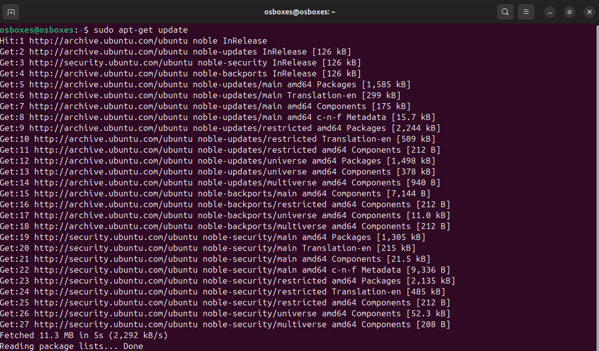
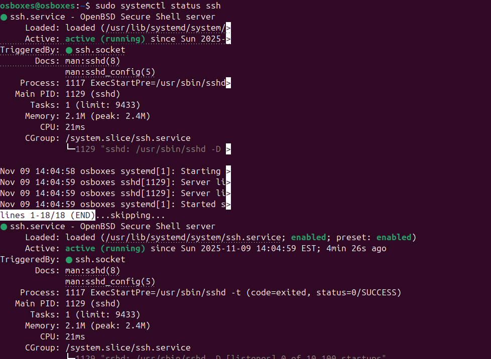
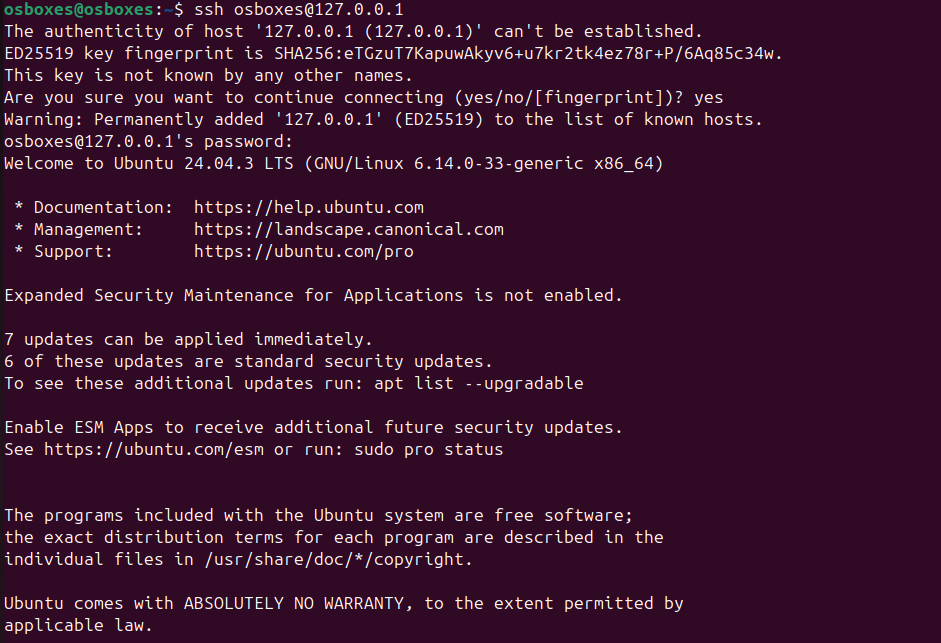
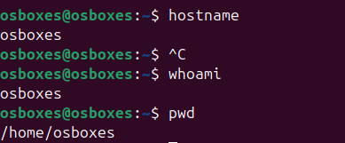
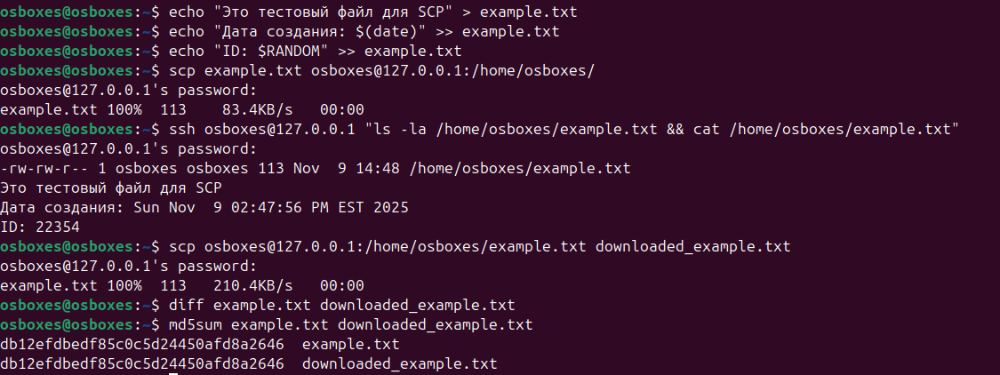
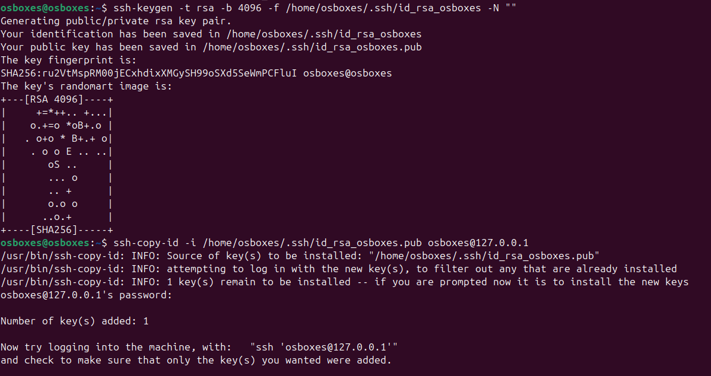
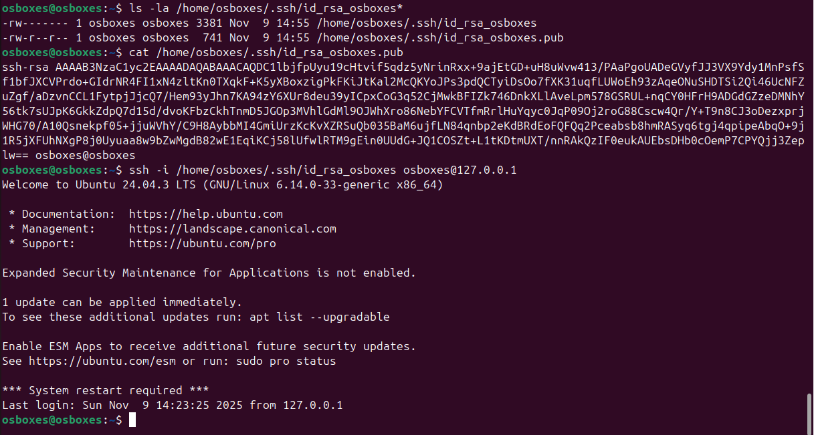

# Домашнее задание по теме «Работа с серверами и протокол удалённого управления SSH»

**Студент:** Podgornov Vladislav
**Репозиторий:** https://github.com/podgornowwlad-lgtm/ssh-homework

## Выполненные кейсы

###  Кейс 1: Установка и настройка SSH-сервера
- Установлен OpenSSH-server
- Статус сервера: `Active: active (running)`
- Автозапуск включен

###  Кейс 2: Подключение к удаленному серверу
- Успешное подключение по SSH: `ssh osboxes@127.0.0.1`
- Проверка в сессии: пользователь `osboxes`, хост `osboxes`

###  Кейс 3: Копирование файлов с помощью SCP
- Файл успешно скопирован на сервер и обратно
- Целостность данных подтверждена

###  Кейс 4: Работа с ключами SSH
- Сгенерирована пара ключей RSA 4096 бит
- Публичный ключ добавлен на сервер
- Настроен вход без пароля

